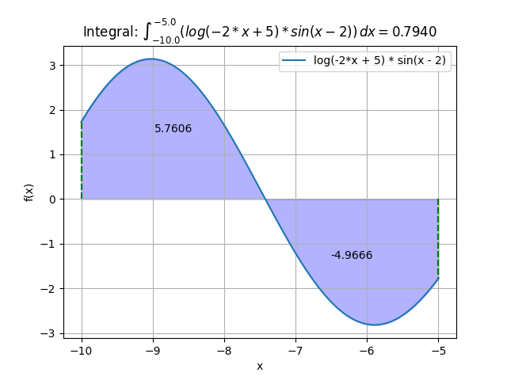

# Calculadora de Integrales

## Descripción General

Esta aplicación permite calcular integrales definidas e indefinidas de funciones matemáticas utilizando la biblioteca SymPy en Python. La calculadora acepta una función matemática como entrada y proporciona el resultado de la integral.

## Método

1. **Entrada de la Función**: Se ingresa la función matemática a integrar.
2. **Cálculo de la Integral**: Se determina la integral de la función utilizando técnicas simbólicas.
3. **Resultado**: Se muestra el resultado de la integral, ya sea definida o indefinida, según la entrada proporcionada.

## Resultados

Para comprobar:
https://es.wolframalpha.com/calculators/integral-calculator

A continuación, se muestra una representación visual de la interfaz de la calculadora de integrales:

## Uso

Para utilizar la calculadora de integrales, siga estos pasos:

### Usando Python

Asegúrese de tener Python y las bibliotecas requeridas instaladas. Luego, ejecute la calculadora con la función deseada:

python run.py "función" "límite_inferior" "límite_superior" "iteraciones"

### Usando Docker

Asegúrese de tener Docker instalado en su sistema. Navegue al directorio de la calculadora de integrales en su terminal y ejecute la calculadora utilizando el script proporcionado:

./run.sh "función" "límite_inferior" "límite_superior" "iteraciones"

ALLOWED_FUNCTIONS = {
    'sin': sp.sin,
    'cos': sp.cos,
    'tan': sp.tan,
    'exp': sp.exp,
    'sqrt': sp.sqrt,
    'log': sp.log,
    'log10': sp.log,
    'pi': sp.pi,
    'e': sp.E
}

